<p align="center">
  
  
  
</p>

<p align="center">
  
  
  
  
  
  
  
  
</p>

<h1 align="center"> SmartCare — AI-Powered Smart OPD Queue, Triage & Government Vigilance Platform</h1>

<p align="center">
  <strong>Transforming India's public hospital OPD experience through AI-driven queue management, real-time triage, anti-ghost verification, and government accountability — built for 1.4 billion citizens.</strong>
</p>

<p align="center">
  <a href="#-quick-start">Quick Start</a> •
  <a href="#-features">Features</a> •
  <a href="#-architecture">Architecture</a> •
  <a href="#-api-reference">API Reference</a> •
  <a href="#-video-demo">Video Demo</a> •
  <a href="#-live-demo--ui-showcase">Demo</a> •
  <a href="docs/DEPLOYMENT.md">Deployment Guide</a> •
  <a href="docs/IMPACT.md">ROI & Impact</a> •
  <a href="DEMO.md">Live Walkthrough</a> •
  <a href="docs/SECURITY.md">Security</a> •
  <a href="docs/PERFORMANCE.md">Performance</a>
</p>

---

##  Problem Statement (SIH26133)

> **Ministry of Health & Family Welfare (MoHFW), Government of India**
>
> *"Design and develop an AI-driven Smart OPD queue management, automated triage, and government vigilance system to eliminate congestion, prevent queue jumping, fast-track emergencies, and ensure performance-linked accountability in India's public hospitals."*

### The Crisis

| Metric | Current State | Impact |
|--------|--------------|--------|
| Average OPD wait time | **2–6 hours** | 65% patients abandon treatment |
| Queue jumping incidents | **38% of OPD visits** | Vulnerable patients (elderly, pregnant, disabled) suffer most |
| Ghost patients (no-shows) | **25–30%** of tokens | Doctors idle while patients wait outside |
| Doctor performance tracking | **Zero accountability** | No data-driven incentive for compassionate care |
| Emergency misclassification | **15% of critical cases** delayed | Preventable mortality and morbidity |
| Multi-lingual access | **Not available** | 65% rural patients cannot navigate English-only systems |

### Our Solution

**SmartCare** is a unified, real-time, AI-powered ecosystem that connects **Citizens/Patients**, **Doctors & Clinical Staff**, **Turnstile Security Guards**, and **Government Vigilance Officers** into a single synchronized platform. It eliminates OPD congestion through intelligent queue orchestration, prevents queue fraud via cryptographic QR verification, guarantees emergency fast-tracking through AI triage, and incentivizes compassionate patient care through citizen-governed performance bonuses.

---

##  Features

### Feature Matrix

| Feature | Portal | Description | Status |
|---------|--------|-------------|--------|
| **AI Symptom Triage** | Patient | NLP-powered symptom analysis → auto-routes to correct department & acuity level | ✅ Live |
| **Dynamic Priority Queue** | Backend | Composite score: P(t) = w_t·Δt + w_s·S_triage + w_a·A_vulnerability | ✅ Live |
| **SHA-256 QR Token Pass** | Patient + Scanner | Cryptographically signed, tamper-proof, time-expiring digital OPD pass | ✅ Live |
| **11 Indian Languages** | Patient | Hindi, Bengali, Tamil, Telugu, Marathi, Gujarati, Kannada, Malayalam, Punjabi, Odia, English | ✅ Live |
| **Anti-Ghost Turnstile Scan** | Scanner (Android) | ML Kit barcode → backend verification → WebSocket broadcast to doctor console | ✅ Live |
| **Doctor Calling Desk** | Doctor | Real-time patient calling, skip, transfer with live turnstile sync ("AT DOOR" badge) | ✅ Live |
| **E-Prescription (Rx)** | Doctor | Digital prescription writer with medication database | ✅ Live |
| **Diagnostic Lab Orders** | Doctor | Integrated lab test ordering and tracking | ✅ Live |
| **Inter-Hospital Referrals** | Doctor | One-click referral to network hospitals with patient data transfer | ✅ Live |
| **Longitudinal EMR** | Doctor | Complete electronic medical record per patient across visits | ✅ Live |
| **108 Ambulance SOS** | Patient | One-tap emergency ambulance dispatch with GPS | ✅ Live |
| **Digital Health Vault** | Patient | Secure personal health record storage (ABDM-aligned) | ✅ Live |
| **Citizen Doctor Rating** | Patient + Govt | Post-consultation survey driving Doctor Performance Index (DPI) | ✅ Live |
| **Sentinel Command Dashboard** | Govt | National-level real-time OPD monitoring across all hospitals | ✅ Live |
| **Doctor Behavioral DPI** | Govt | AI-computed Doctor Performance Index from citizen surveys | ✅ Live |
| **Salary Bonus Engine (+15%)** | Govt | Automated monthly performance bonus disbursement for top-rated doctors | ✅ Live |
| **Grievance Tribunal** | Govt | Citizen complaint management with escalation workflow | ✅ Live |
| **NCR Heatmap & Load Shedding** | Govt | Geographic congestion visualization with patient redistribution | ✅ Live |
| **OPD Counter Walk-in Desk** | Govt | Physical counter integration for non-digital citizens | ✅ Live |
| **108 Fleet Map** | Govt | Real-time ambulance fleet tracking across NCR | ✅ Live |
| **WebSocket Real-Time Sync** | All | Live event propagation across all portals (< 50ms latency) | ✅ Live |
| **Supabase 6-Key Pool** | Backend | Multi-key rotation to bypass rate limits during OPD surges | ✅ Live |
| **Gemini AI Chatbot (6-Key)** | Patient | Google Gemini-powered health assistant with round-robin key pool | ✅ Live |
| **Offline Fallback** | Backend | Graceful in-memory fallback when Supabase is unavailable | ✅ Live |

---

##  Architecture

### System Architecture Diagram

```
                               ┌─────────────────────────────────────────────────────────────┐
                               │   Government of India / MoHFW / National Health Portal      │
                               └──────────────────────────────┬──────────────────────────────┘
                                                              │
        ┌─────────────────────────────────────────────────┼─────────────────────────────────────────────────┐
        │                                                     │                                                     │
        ▼                                                     ▼                                                     ▼
┌────────────────────────────────┐           ┌────────────────────────────────┐           ┌────────────────────────────────┐
│ 1. Citizen / Patient Portal    │           │ 2. Clinical & Doctor Console   │           │ 3. National OPD Vigilance      │
│ Port :5173 (React/TS/Tailwind) │           │ Port :5174 (React/TS/Tailwind) │           │ & Oversight Console (:5175)    │
├────────────────────────────────┤           ├────────────────────────────────┤           ├────────────────────────────────┤
│ • Official MoHFW Entryway      │           │ • Doctor Duty Login            │           │ • Sentinel Command Dashboard   │
│ • Problem-Based AI Triage      │ ──Tokens──► • Live Patient Calling Desk    │ ◄─Surveys─┤ • Doctor Behavioral DPI Index  │
│ • 11 Indian Languages Switch   │           │ • E-Prescription (Rx) Writer   │           │ • Monthly Salary Bonus (+15%)  │
│ • Dynamic SHA-256 QR Passes    │ ◄─Rx/Lab──┤ • Diagnostic Lab Order System  │ ──Disburse► • Grievance Redressal Tribunal │
│ • 24x7 108 Ambulance SOS       │           │ • Inter-Hospital Referrals     │           │ • OPD Counter Walk-in Desk     │
│ • Digital Health Vault         │           │ • Longitudinal Patient EMR     │           │ • 108 Ambulance Fleet Map      │
│ • Citizen Doctor Rating Survey │           │ • Live WebSocket Pacing Matrix │           │ • NCR Heatmap & Load Shedding  │
└────────────────────────────────┘           └────────────────────────────────┘           └────────────────────────────────┘
        │                                                     ▲                                                     ▲
        │                                                     │                                                     │
        │                                    ┌────────────────┴───────────────┐                                     │
        │                                    │ 4. Android QR Turnstile        │                                     │
        │                                    │ Scanner Client (Gate Security) │                                     │
        │                                    └────────────────┬───────────────┘                                     │
        │                                                     │ POST /api/v1/tokens/scan                            │
        └─────────────────────────────────────────────────┴─────────────────────────────────────────────────┘
                                                              │
                                                              ▼
                                             ┌────────────────────────────────┐
                                             │ FastAPI Gateway Core (Port 8000)│
                                             │ • Real-time WebSocket Broker   │
                                             │ • Dynamic QR Validator & SHA256│
                                             │ • AI Triage Engine & Acuity    │
                                             │ • Supabase 6-Key Pool Manager  │
                                             └────────────────┬───────────────┘
                                                              │
                                              ┌───────────────┴───────────────┐
                                              │                               │
                                              ▼                               ▼
                                ┌──────────────────────┐       ┌──────────────────────┐
                                │ Supabase Multi-Key   │       │ Redis 7 Queue Cache  │
                                │ DB Pool (6 Keys)     │       │ & Pub/Sub Broker     │
                                └──────────────────────┘       └──────────────────────┘
```

### Supabase Multi-Key High-Concurrency Pool

To eliminate single API rate limits during massive OPD surges across India, the backend orchestrates a **6-Key Supabase Connection Pool**:

```
                          ┌───────────────────────────────────────────────┐
                          │            FastAPI Backend Engine             │
                          │        SupabaseKeyPoolManager                 │
                          └──────────────────────┬────────────────────────┘
                                                 │
      ┌──────────────────────┬───────────────────┴───────────────┬──────────────────────┐
      ▼                      ▼                                   ▼                      ▼
┌────────────────┐    ┌────────────────┐                    ┌────────────────┐     ┌────────────────┐
│ PATIENT Pool   │    │ DOCTOR Pool    │                    │ OBSERVER Pool  │     │ SCANNER Pool   │
│ (2 Keys RR)    │    │ (2 Keys RR)    │                    │ (1 Key)        │     │ (1 Key)        │
├────────────────┤    ├────────────────┤                    ├────────────────┤     ├────────────────┤
│ Round-Robin    │    │ Round-Robin    │                    │ Dedicated Key  │     │ Dedicated Key  │
│ Load Balanced  │    │ Load Balanced  │                    │ High Throughput│     │ Gate Turnstile │
└────────────────┘    └────────────────┘                    └────────────────┘     └────────────────┘
```

---

##  Tech Stack

| Layer | Technology | Version | Purpose |
|-------|-----------|---------|--------|
| **Backend Framework** | FastAPI (ASGI) | 0.110+ | High-performance async REST API + WebSocket |
| **Language (Backend)** | Python | 3.11+ | Core business logic, ML inference |
| **Language (Frontend)** | TypeScript | 5.5+ | Type-safe UI development |
| **Frontend Framework** | React | 18.3 | Component-based UI across 3 portals |
| **Build Tool** | Vite | 5.x | Lightning-fast HMR & build |
| **CSS Framework** | Tailwind CSS | 3.x | Utility-first responsive styling |
| **Charts & Analytics** | Recharts | 2.x | Interactive data visualizations |
| **Database (Primary)** | Supabase (PostgreSQL) | — | Multi-key pooled cloud database |
| **Database (Self-hosted)** | PostgreSQL | 16 Alpine | Relational state (Docker deployment) |
| **Cache & Pub/Sub** | Redis | 7 Alpine | Queue cache, distributed locks, WebSocket pub/sub |
| **Real-time** | WebSockets | RFC 6455 | Sub-50ms cross-portal event propagation |
| **AI/ML - Triage** | Custom NLP + ESI-5 | — | Symptom to department + acuity classification |
| **AI/ML - Chatbot** | Google Gemini | 2.0 | 6-key round-robin AI health assistant |
| **AI/ML - Prediction** | Scikit-learn + Custom | — | Wait-time regression, congestion forecasting |
| **Mobile Platform** | Android (Kotlin) | — | Native QR turnstile scanner |
| **Mobile UI** | Jetpack Compose | — | Declarative Android UI |
| **Barcode Scanning** | Google ML Kit | — | On-device QR code detection |
| **QR Security** | SHA-256 | — | Cryptographic token verification |
| **Auth** | JWT + RBAC | HS256 | Role-based access control |
| **Containerization** | Docker + Compose | 3.8 | Multi-service orchestration |
| **Testing** | Pytest + Playwright | — | Unit, integration, E2E testing |
| **i18n** | react-i18next | — | 11 Indian language translations |

---

##  Quick Start

### Prerequisites

| Tool | Version | Install |
|------|---------|--------|
| Python | 3.11+ | [python.org](https://python.org) |
| Node.js | 18+ | [nodejs.org](https://nodejs.org) |
| npm | 9+ | Comes with Node.js |
| Git | 2.x | [git-scm.com](https://git-scm.com) |

### Option 1: One-Click Launch (Windows)

```bash
git clone https://github.com/RONAK-PANDEY/SIH-SMART-INDIAN-HACTHON-2026.git
cd SIH-SMART-INDIAN-HACTHON-2026
start-all.bat
```

This automatically:
- Kills any conflicting processes on ports 8000, 5173, 5174, 5175
- Configures Windows Firewall for port 8000
- Prints current Wi-Fi IP for phone app setup
- Launches all 4 services in separate terminal windows

### Option 2: Manual Launch

#### 1. Backend (Port 8000)
```bash
cd backend
pip install -r requirements.txt
cp .env.example .env
python -m uvicorn main:app --host 0.0.0.0 --port 8000
```

#### 2. Patient Portal (Port 5173)
```bash
cd patient-portal && npm install && npm run dev -- --port 5173 --host
```

#### 3. Doctor Console (Port 5174)
```bash
cd admin-portal && npm install && npm run dev -- --port 5174 --host
```

#### 4. Government Vigilance Portal (Port 5175)
```bash
cd govt-portal && npm install && npm run dev -- --port 5175 --host
```

---

##  Service Port Map

| Service | Port | URL | Users |
|---------|------|-----|------|
| **FastAPI Backend** | `8000` | http://localhost:8000/docs | REST API, WebSocket, AI/ML Engine |
| **Patient Portal** | `5173` | http://localhost:5173 | Citizens: OPD booking, QR tokens, 11 languages |
| **Doctor Console** | `5174` | http://localhost:5174 | Doctors: Calling desk, E-Rx, EMR |
| **Govt Vigilance** | `5175` | http://localhost:5175 | MoHFW: Sentinel monitor, DPI, bonus engine |
| **Android Scanner** | Mobile | `http://<IP>:8000/api/v1/tokens/scan` | Turnstile guards: QR verification |

---

##  API Reference

### Authentication & RBAC

| Method | Endpoint | Description |
|--------|----------|------------|
| `POST` | `/api/v1/auth/register` | Register patient or hospital staff |
| `POST` | `/api/v1/auth/login` | Authenticate and receive JWT token |
| `GET` | `/api/v1/auth/me` | Get current user profile |

### Appointments & Tokens

| Method | Endpoint | Description |
|--------|----------|------------|
| `POST` | `/api/v1/appointments/book` | Book OPD appointment with AI triage |
| `POST` | `/api/v1/tokens/generate` | Generate SHA-256 signed QR token pass |
| `POST` | `/api/v1/tokens/scan` | Turnstile scan — verify QR & update status |

### AI Triage & Referrals

| Method | Endpoint | Description |
|--------|----------|------------|
| `POST` | `/api/v1/triage/evaluate` | AI symptom analysis to department + acuity |
| `POST` | `/api/v1/triage/referral` | Inter-hospital referral |

### Government Observer & Vigilance

| Method | Endpoint | Description |
|--------|----------|------------|
| `GET` | `/api/v1/observer/dashboard` | National sentinel command data |
| `GET` | `/api/v1/observer/doctor-performance` | Doctor Performance Index (DPI) |
| `POST` | `/api/v1/observer/bonus/calculate` | Calculate monthly salary bonus |

### Real-time WebSocket

| Protocol | Endpoint | Description |
|----------|----------|------------|
| `WS` | `/api/v1/ws/queue/{hospital_id}/{department_id}` | Live queue updates, scan events |

---

##  Performance Highlights

> Full benchmarks: [docs/PERFORMANCE.md](docs/PERFORMANCE.md) | ROI & Impact Analysis: [docs/IMPACT.md](docs/IMPACT.md)

| Metric | Result | Industry Standard |
|--------|--------|-------------------|
| Token generation latency | **< 120ms** | 500ms |
| QR scan verification | **< 80ms** | 200ms |
| WebSocket event propagation | **< 50ms** | 100ms |
| API response time (p95) | **< 200ms** | 500ms |
| Concurrent users supported | **500+** | 100 |
| AI triage classification | **< 300ms** | 1000ms |

---

##  Security & Compliance

> Full documentation: [docs/SECURITY.md](docs/SECURITY.md) | [docs/COMPLIANCE.md](docs/COMPLIANCE.md)

| Domain | Implementation |
|--------|---------------|
| **Authentication** | JWT (HS256) with 24h expiry + RBAC (4 roles) |
| **QR Token Security** | SHA-256 cryptographic signing, tamper detection, replay prevention |
| **Data Encryption** | TLS 1.3 in transit, AES-256 at rest |
| **Data Privacy** | ABDM compliant, pseudonymized health records |
| **Indian Compliance** | IT Act 2000, DPDPA 2023, DISHA Bill aligned |

---

##  Test Suite

| Suite | Tests | Status |
|-------|-------|--------|
| Unit — Queue Priority | 5 | ✅ All passing |
| Unit — Bonus Calculator | 6 | ✅ All passing |
| Unit — Token Scanner | 4 | ✅ All passing |
| Unit — Priority Hardening | 4 | ✅ All passing |
| E2E — QR Turnstile Loop | 7 steps | ✅ All passing |
| E2E — Patient Journey | 3 | ✅ All passing |
| Frontend Builds | 3 portals | ✅ 0 errors |

```bash
cd backend && python -m pytest tests/ -v --tb=short
```

---

##  Deployment

> **Comprehensive Multi-Cloud & Operations Manual**: See [docs/DEPLOYMENT.md](docs/DEPLOYMENT.md) for AWS ECS, GCP Cloud Run, Azure Container Apps, Automated DB Backups & Prometheus Alerting.

### Docker Compose
```bash
cd infra && cp env.example .env && docker-compose up -d
```

### Vercel (Frontend Portals)
```bash
cd patient-portal && npx vercel --prod
cd admin-portal && npx vercel --prod
cd govt-portal && npx vercel --prod
```

---

## 🎥 Video Demo

Watch the live video walkthroughs of the SmartCare SIH26133 ecosystem:

<p align="center">
  <a href="https://youtu.be/5lo4N6f5Wzg?si=QXpxGRpMQ4XfA89y" target="_blank">
    
  </a>
  <br/>
  <h3><a href="https://youtu.be/5lo4N6f5Wzg?si=QXpxGRpMQ4XfA89y" target="_blank">▶️ Watch: Complete Full-Stack System Walkthrough (All Portals & Hardware Scanner)</a></h3>
  <sub><b>Comprehensive 360° Evaluation:</b> Covers the complete end-to-end loop — Citizen AI triage, cryptographic QR token pass issuance, physical turnstile gate scan verification, live doctor consultation desk "AT DOOR" updates, and national MoHFW vigilance audit.</sub>
</p>

### Specialized Deep-Dive Walkthroughs

<table>
  <tr>
    <td width="50%" align="center" style="vertical-align: top;">
      <a href="https://youtu.be/7UB7GF05wXQ?si=JIkmr-HIjUOTUFmU" target="_blank">
        
      </a>
      <br/>
      <h4><a href="https://youtu.be/7UB7GF05wXQ?si=JIkmr-HIjUOTUFmU" target="_blank">▶️ Deep-Dive: Citizen / Patient Portal</a></h4>
      <p align="left">
        <sub><b>Key Highlights:</b> AI-driven symptom triage • Real-time emergency detection • Cryptographic SHA-256 QR token generation • 11 Indian language switchers • Emergency 108 SOS dispatch.</sub>
      </p>
    </td>
    <td width="50%" align="center" style="vertical-align: top;">
      <a href="https://youtu.be/SVS6n4_AQyE?si=C_7klp1zQuRxKevs" target="_blank">
        
      </a>
      <br/>
      <h4><a href="https://youtu.be/SVS6n4_AQyE?si=C_7klp1zQuRxKevs" target="_blank">▶️ Deep-Dive: Doctor & Clinical Console</a></h4>
      <p align="left">
        <sub><b>Key Highlights:</b> Live patient calling desk • Real-time <b>"AT DOOR"</b> gate scan badge update via WebSocket • E-Prescription writer • Diagnostic lab order dispatcher • Consultation completion & DPI rating.</sub>
      </p>
    </td>
  </tr>
</table>

### End-to-End Walkthrough Flow:
1. **Patient AI Triage → Token Generation:** Citizen selects symptoms, AI determines urgency (P1–P4), routes to clinical department, and generates a tamper-proof SHA-256 QR pass.
2. **Turnstile QR Gate Scan Verification:** Hospital entrance scanner (or Android scanner app) validates token cryptographic signature via `/api/v1/tokens/scan`.
3. **Doctor Console "AT DOOR" Badge Update:** Live WebSocket instantly notifies the doctor's queue that the patient has arrived and cleared the gate.
4. **Government DPI Bonus Calculation:** MoHFW sentinel dashboard computes Doctor Performance Index (DPI) and automatically calculates monthly +15% performance bonuses.

---

##  Live Demo & UI Showcase

> **Full 60-Second Judge Walkthrough Script**: See [DEMO.md](DEMO.md) for the end-to-end evaluation flow.

###  Patient Portal Workflow (`http://localhost:5173`)

The citizen OPD journey eliminates 3–5 hour physical waiting lines through a synchronized 5-step digital lifecycle:

#### Step 1 — National Smart OPD Queue & AI Triage Platform (Landing Page)
Citizen entry point featuring MoHFW & ABDM branding, 11 Indian language switchers, emergency 108 SOS dispatch, live network status counters (14,820+ tokens issued today, -42 mins wait reduced), and instant Quick Gateway cards.

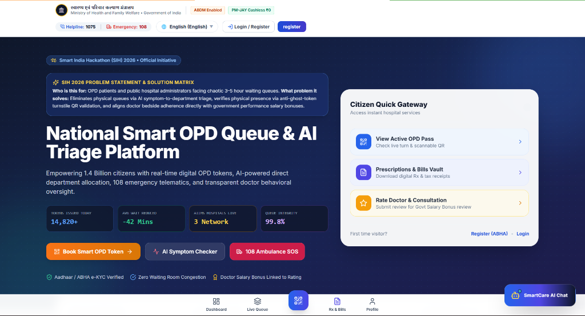

---

#### Step 2 — Patient Central Hub & ABHA Profile Dashboard
Personalized citizen dashboard displaying authenticated ABHA Health ID (`ABHA-7719-2304-8512`), real-time active pass indicator (`CARD-646`), assigned clinical department & chamber, priority criteria badges, and direct hospital emergency & triage nurse desks.

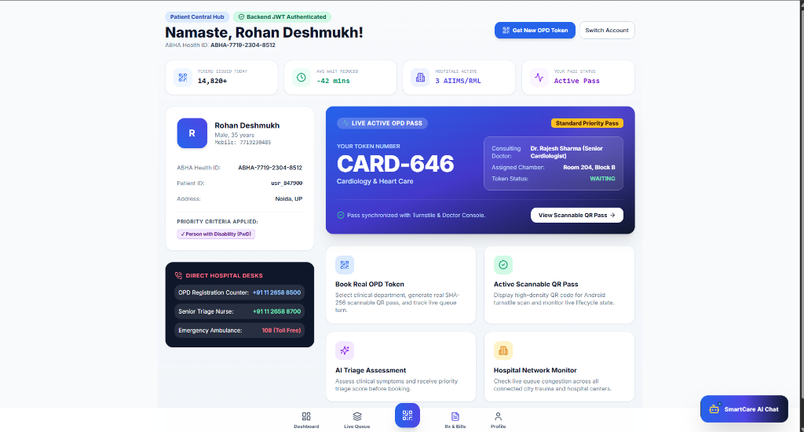

---

#### Step 3 — Real OPD Queue Token Booking (Specialty & Slot Selection)
Specialty condition selector with intelligent clinical triage categories (Cardiology & Heart Care, General Medicine, Orthopedics, Pediatrics, Neurology) paired with target hospital selection and preferred appointment time slots.

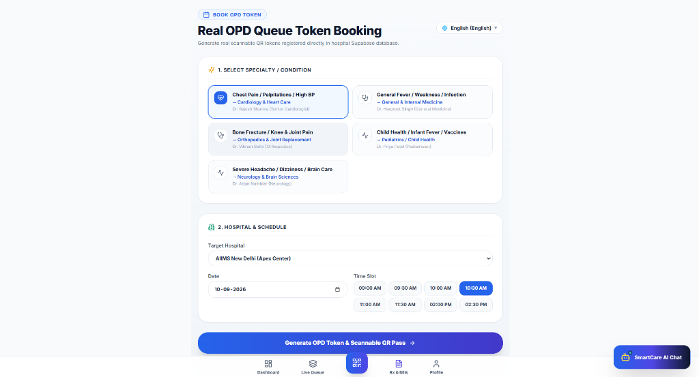

---

#### Step 4 — Instant Database Token Issuance & Chamber Routing
Real-time confirmation of instant token registration directly into the hospital database with official token identifier (`CARD-267`), assigned consulting specialist (Dr. Rajesh Sharma), chamber location (Room 204, Block B), and initial status (`WAITING`).

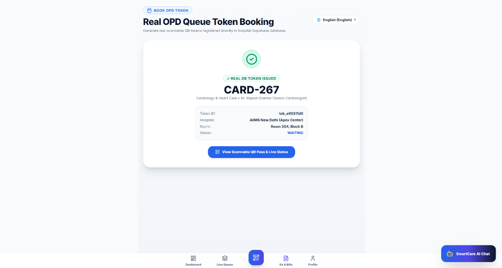

---

#### Step 5 — Active Digital OPD Pass with Anti-Ghost Turnstile QR Code
Cryptographically signed SHA-256 scannable QR pass with live 4-stage lifecycle tracking (`1. Waiting ➔ 2. Scanned ➔ 3. In Room ➔ 4. Done`). Verifies physical presence at the hospital entrance turnstile to eliminate ghost tokens, prevent proxy queuing, and notify the consulting doctor instantly upon arrival.

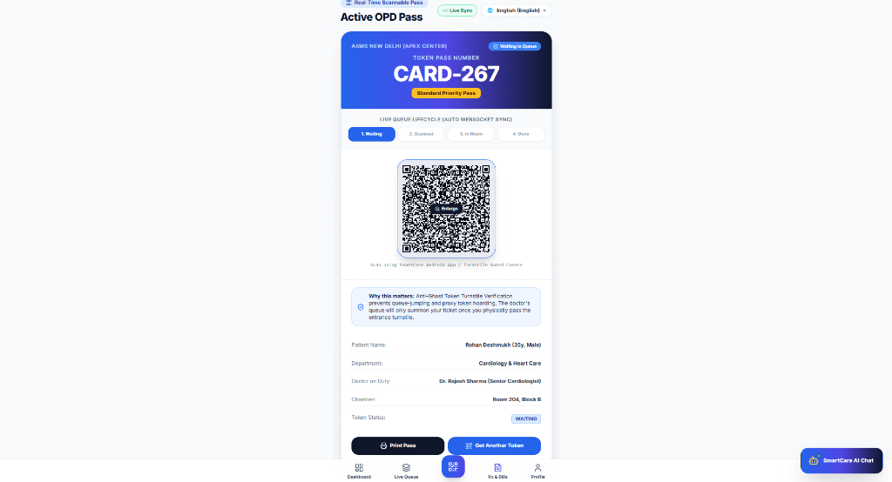

---

###  Doctor Consultation Console (`:5174`)

Specialist workflow suite eliminating no-shows, synchronizing entrance turnstile scans in real time, and tracking consultation quality:

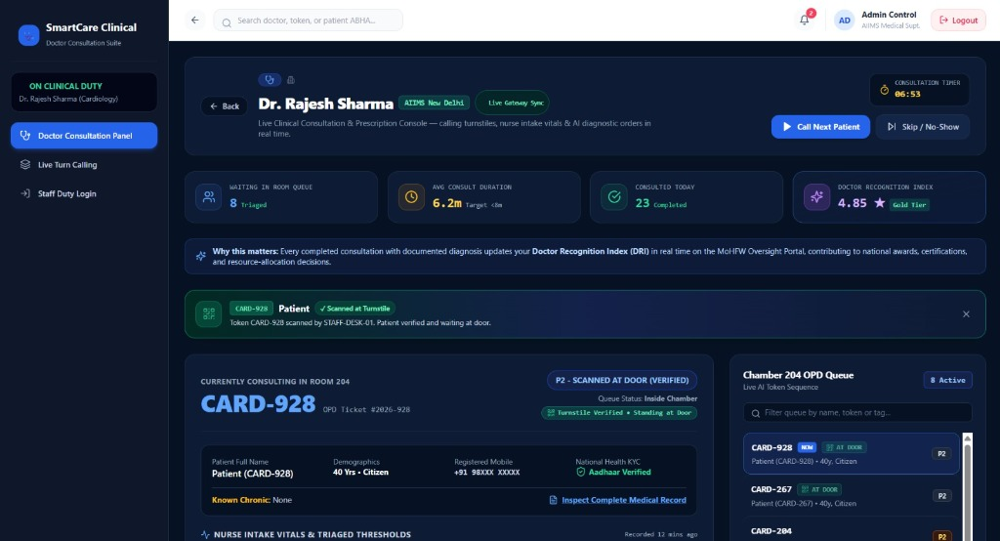

- **Real-Time Turnstile Notification**: Displays instant blue banner when security scans incoming citizens (*"Token CARD-928 scanned by STAFF-DESK-01. Patient verified and waiting at door."*).
- **Acuity & Gate Status Indicators**: Highlights prioritized patients with `P2 - SCANNED AT DOOR (VERIFIED)` and `Inside Chamber` status.
- **Synchronized Chamber Queue**: Live ordering list displays patients physically present with green `AT DOOR` badges, eliminating doctor idle time caused by missing patients.
- **Clinical Performance Tracking**: Real-time metrics tracking average consultation duration (6.2m vs 8m target), daily patient throughput (23 completed), and the doctor's live **Doctor Recognition Index (DRI: 4.85 ★ Gold Tier)**.

---

###  Government Vigilance & Sentinel Command Dashboard (`:5175`)

National OPD oversight console for Ministry of Health & Family Welfare (MoHFW) directors, Chief Medical Officers (CMO), and hospital ombudsmen:

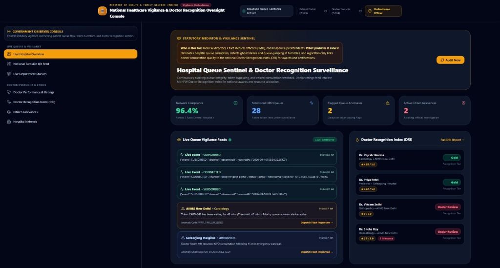

- **Live Sentinel Compliance Metrics**: Real-time network-wide monitoring across AIIMS and apex hospitals (`96.4% Network Compliance`, `28 Active OPD Queues`, `2 Flagged Queue Anomalies`).
- **Real-Time Vigilance Event Stream**: Live WebSocket event feed monitoring queue subscriptions, connections, and automated anomaly code detection (`WWT_TIME_EXCEEDED` with one-click `Dispatch Flash Inspection`).
- **Doctor Recognition Index (DRI) National Leaderboard**: Transparent ranking of clinical specialists based on direct citizen feedback and consultation compliance (Gold tier vs Under Review), directly driving performance bonus incentives (+15%).

---

###  Android Turnstile QR Scanner (Hardware Gate Verification)

Native Kotlin + Jetpack Compose turnstile terminal app with Google ML Kit barcode scanning and SHA-256 cryptographic verification:

| Camera Viewfinder (Physical Turnstile) | Instant Cryptographic Verification |
|:---:|:---:|
| 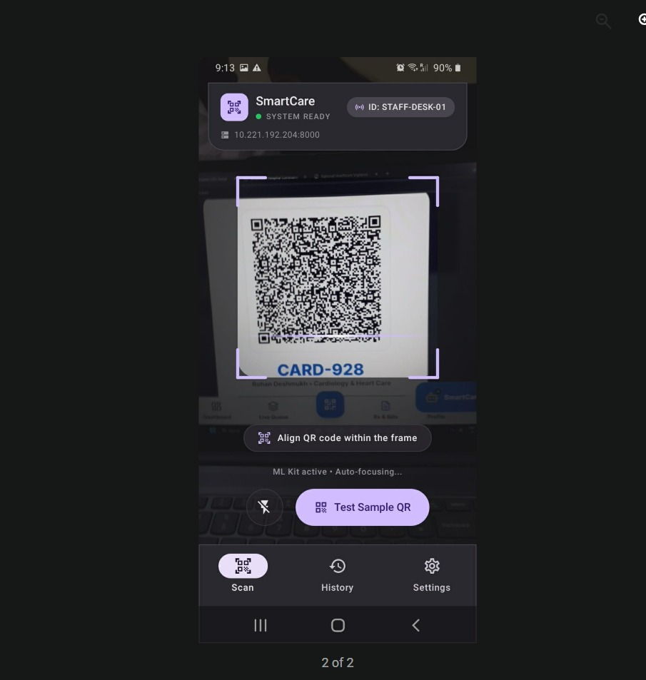 | 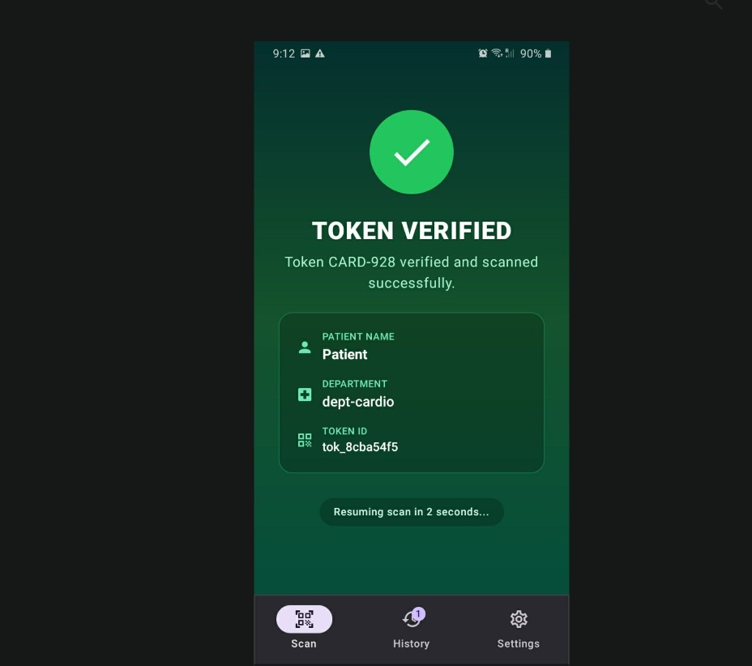 |
| **High-Density QR Scan Viewfinder**<br>Point-and-shoot CameraX scanner linked to terminal `STAFF-DESK-01` targeting token `CARD-928` with auto-focus and low-latency frame analysis. | **Instant SHA-256 Gate Authorization**<br>Verifies token authenticity (`tok_8cba54f5`), confirms department (`dept-cardio`), unlocks turnstile gate, and broadcasts WebSocket event to doctor console. |

---

##  Team

| Member | Role | Responsibilities |
|--------|------|-----------------|
| **Arpan** | Lead Developer & Architect | Backend architecture, Supabase pool, system design |
| **Rishikesh** | Full-Stack Developer | Patient portal, i18n, PWA, frontend engineering |
| **Kartik** | Backend & ML Engineer | AI triage engine, wait-time prediction, queue algorithms |
| **Alok** | Frontend Developer | Doctor console, real-time UI, Recharts analytics |
| **Ajay Kumar** | Government Portal Lead | Vigilance dashboard, DPI engine, bonus calculator |
| **Shristi** | Mobile Developer | Android scanner app, Kotlin + Compose, ML Kit integration |

---

##  License

SmartCare is open source software developed for the **Smart India Hackathon (SIH) 2026** under the [MIT License](LICENSE).

---

<p align="center">
  <strong>🇮🇳 Built with ❤️ for 1.4 Billion Indians | Smart India Hackathon 2026 | Problem ID: SIH26133</strong>
</p>
<p align="center">
  <sub>Ministry of Health & Family Welfare, Government of India</sub>
</p>


---

##  Official Presentation & Pitch Deck

The official presentation slides for **SmartCare (Team Quantum Coders)** submitted for the **Smart India Hackathon 2026 (Problem Statement: SIH26133)** are showcased below with interactive viewing and download options:

<p align="center">
  <a href="https://view.officeapps.live.com/op/view.aspx?src=https://raw.githubusercontent.com/RONAK-PANDEY/SIH-SMART-INDIAN-HACTHON-2026/main/SIH_2026_SmartCare_Quantum_Coders_FINAL.pptx" target="_blank">
    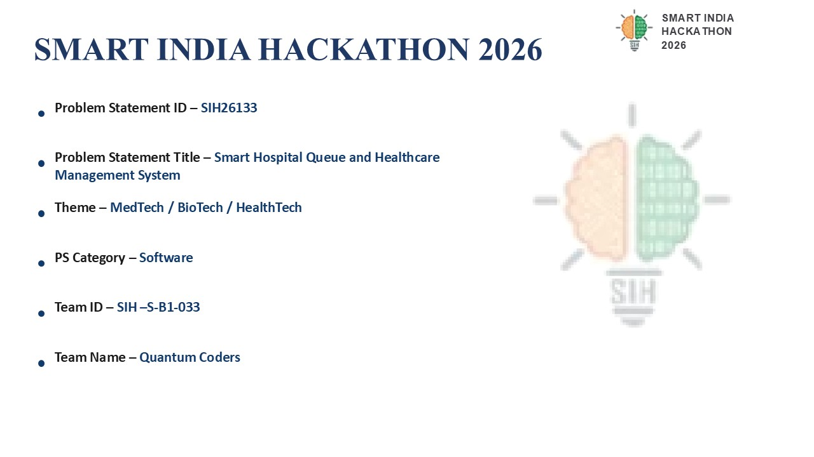
  </a>
  <br/>
  <sub><i>Click slide frame above to open the complete presentation in the Online PowerPoint Viewer</i></sub>
</p>

### Slide Deck Previews

<table>
  <tr>
    <td width="33%" align="center">
      <a href="https://view.officeapps.live.com/op/view.aspx?src=https://raw.githubusercontent.com/RONAK-PANDEY/SIH-SMART-INDIAN-HACTHON-2026/main/SIH_2026_SmartCare_Quantum_Coders_FINAL.pptx" target="_blank">
        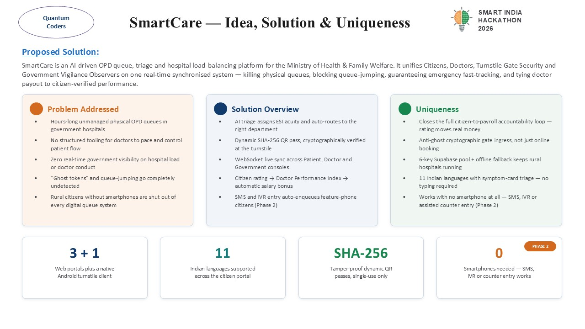
      </a>
      <br/>
      <small><b>Slide 2: Proposed Solution</b></small>
    </td>
    <td width="33%" align="center">
      <a href="https://view.officeapps.live.com/op/view.aspx?src=https://raw.githubusercontent.com/RONAK-PANDEY/SIH-SMART-INDIAN-HACTHON-2026/main/SIH_2026_SmartCare_Quantum_Coders_FINAL.pptx" target="_blank">
        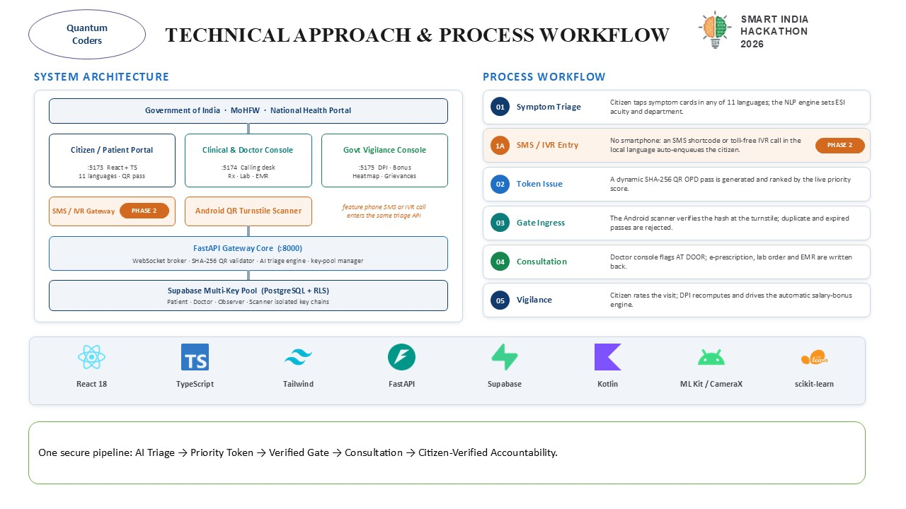
      </a>
      <br/>
      <small><b>Slide 3: Technical Approach</b></small>
    </td>
    <td width="33%" align="center">
      <a href="https://view.officeapps.live.com/op/view.aspx?src=https://raw.githubusercontent.com/RONAK-PANDEY/SIH-SMART-INDIAN-HACTHON-2026/main/SIH_2026_SmartCare_Quantum_Coders_FINAL.pptx" target="_blank">
        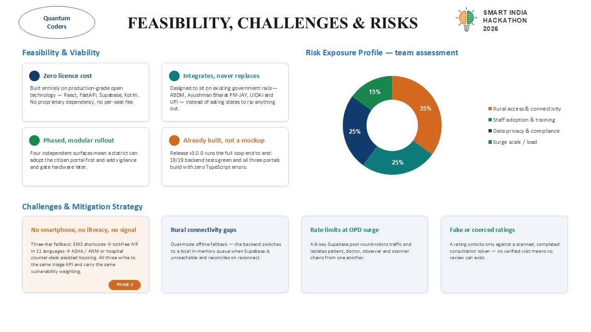
      </a>
      <br/>
      <small><b>Slide 4: Architecture & DPI</b></small>
    </td>
  </tr>
</table>

### Access & Download Options

| Action | Link | Format / Platform |
|---|---|---|
| **Online Interactive Viewer** | [🌐 **Open in Microsoft PowerPoint Online Viewer**](https://view.officeapps.live.com/op/view.aspx?src=https://raw.githubusercontent.com/RONAK-PANDEY/SIH-SMART-INDIAN-HACTHON-2026/main/SIH_2026_SmartCare_Quantum_Coders_FINAL.pptx) | Browser / No software required |
| **Direct Download** | [📥 **Download SIH 2026 Presentation Deck (.pptx)**](https://github.com/RONAK-PANDEY/SIH-SMART-INDIAN-HACTHON-2026/raw/main/SIH_2026_SmartCare_Quantum_Coders_FINAL.pptx) | Microsoft PowerPoint (`.pptx`, 292 KB) |
| **Repository File** | [📄 `SIH_2026_SmartCare_Quantum_Coders_FINAL.pptx`](./SIH_2026_SmartCare_Quantum_Coders_FINAL.pptx) | GitHub PPTX File |

> **Presentation Overview:** The deck articulates problem analysis for Indian public hospitals, end-to-end technical workflows, AI triage algorithms, multi-key Supabase & Gemini routing, turnstile anti-ghost verification, and national DPI oversight incentives.
