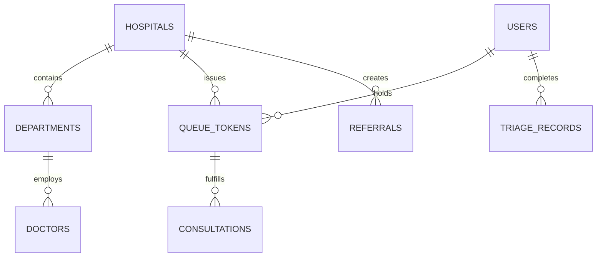

# SmartCare Data Models & Database Schema Spec
> **Maintainer**: Rishikesh  
> **Status**: Single Source of Truth for DB Entities & Pydantic Data Models

---

## 1. Entity Relationship Overview

---

## 2. Core Entities

### 2.1 Users (`users`)
* `id` (UUID / VARCHAR, PK)
* `full_name` (VARCHAR)
* `phone` (VARCHAR, UNIQUE)
* `abha_id` (VARCHAR, NULLABLE)
* `role` (ENUM: `patient`, `doctor`, `staff`, `admin`, `superadmin`)
* `age` (INT)
* `gender` (VARCHAR)
* `created_at` (TIMESTAMP)

### 2.2 Hospitals (`hospitals`)
* `id` (VARCHAR, PK)
* `name` (VARCHAR)
* `city` (VARCHAR)
* `state` (VARCHAR)
* `tier` (ENUM: `primary`, `secondary`, `tertiary`)
* `total_beds` (INT)
* `available_icu_beds` (INT)
* `current_load_percentage` (FLOAT)

### 2.3 Queue Tokens (`queue_tokens`)
* `id` (VARCHAR, PK)
* `token_number` (VARCHAR)
* `patient_id` (VARCHAR, FK -> users.id)
* `hospital_id` (VARCHAR, FK -> hospitals.id)
* `department_id` (VARCHAR)
* `doctor_id` (VARCHAR, FK -> users.id, NULLABLE)
* `priority_score` (FLOAT)
* `triage_level` (INT: 1-5, 1=Immediate Resuscitation, 5=Non-Urgent)
* `status` (ENUM: `WAITING`, `CALLED`, `IN_CONSULTATION`, `COMPLETED`, `SKIPPED`, `REFERRED`)
* `issued_at` (TIMESTAMP)
* `called_at` (TIMESTAMP)
* `completed_at` (TIMESTAMP)
